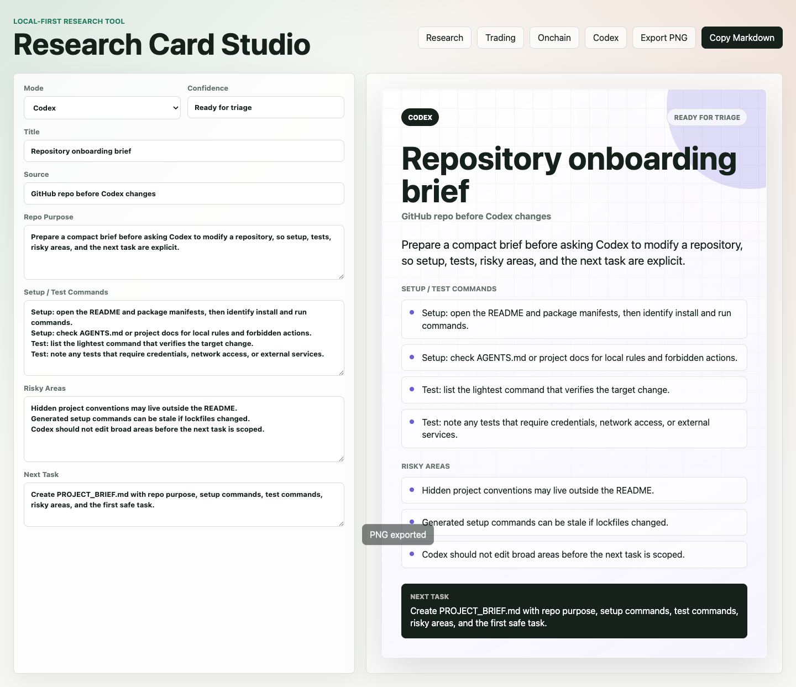

# Research Card Studio

Turn messy research notes into clean, shareable research cards.

Research Card Studio is a local-first static web tool for operators, analysts, and AI-assisted researchers who want to turn a rough thesis into a compact card with conclusion, evidence, risks, and next actions.

It is designed for:

- market notes and trade ideas
- onchain project reviews
- AI agent / repo triage briefs
- lightweight evidence packs before making a decision

No account, no backend, no tracking.

## Demo

Open `index.html` in a browser.



The app includes four built-in card modes:

- Research
- Trading
- Onchain
- Codex

## Features

- live card preview
- four visual themes
- structured fields for conclusion, evidence, risks, and next step
- one-click Markdown export
- one-click PNG export
- one-click sample loading
- local-only workflow

## Codex Repo Brief Mode

Codex mode turns the same card format into a pre-change repository brief. Before asking Codex to edit a repo, capture:

- repo purpose
- setup commands
- test commands
- risky areas
- next task

The Markdown export switches to these repo-brief headings, so the output can be saved as a lightweight `PROJECT_BRIEF.md` or pasted into a Codex task.

## Why This Exists

AI-assisted research often ends as long chat logs, loose screenshots, and scattered notes. This tool forces the note into a small decision card:

- what is the conclusion?
- what evidence supports it?
- what can break it?
- what is the next action?

That makes the work easier to review later and easier to share without overselling confidence.

## Limitations

- This is not financial advice.
- It does not fetch live market or onchain data.
- It does not verify claims automatically.
- Human review is required before acting on any research note.

## Repository Structure

```text
index.html
style.css
app.js
examples/
  research.json
LICENSE
```

## Roadmap

- import / export JSON notes
- add browser extension clipper

## License

MIT
